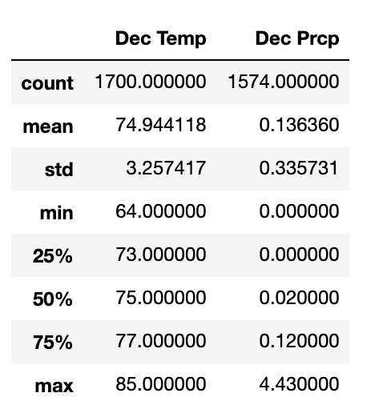

# surfs_up

## Overview of the analysis

### Purpose

- The purpose of this project is to analyze the climate data for the months of June and December in Oahu in order to determine if the surf and ice cream shop business is sustainable year-round the surf and ice cream shop business is sustainable year-round before opening the surf shop. 

- In this project, SQLAlchemy is used to query and create engine of connecting SQLite and Python. Flask application is also used to visualize data for stakeholders.

## Results

The below table shows the summary statistics of temperature and precipitation for June.

The below table shows the summary statistics of temperature and precipitation for June.

From the above tables, the key differences in temperature between June and December are:
1. The mean for June is 74.9, while for December is 71.0 / The difference is 3 Fahrenheit.
2. The max for June is 85, while for December is 83 / The difference is 2 Fahrenheit.
3. The min for June is 64, while for December is 56 / The difference is 8 Fahrenheit.

## Summary

From the temperature statistics, we notice that the mean and maximum temperature of June and December are very similar. The only more obvious difference is minimum temperature of June and December ( 8 degree Fahrenheit lower than June). Therefore, we can conclude that the surf and ice cream shop business is also sustainable in December except for couple of days with relatively lower temperature.

From the precipitation statistics, the overall precipitation in December is lower than in June. Therefore, the surf and ice cream shop business will not affect much by the amount of precipitation in December.

Combine both temperature and precipitation summery statistics, we can conclude that  the surf and ice cream shop business in Oahu is sustainable year-round.
